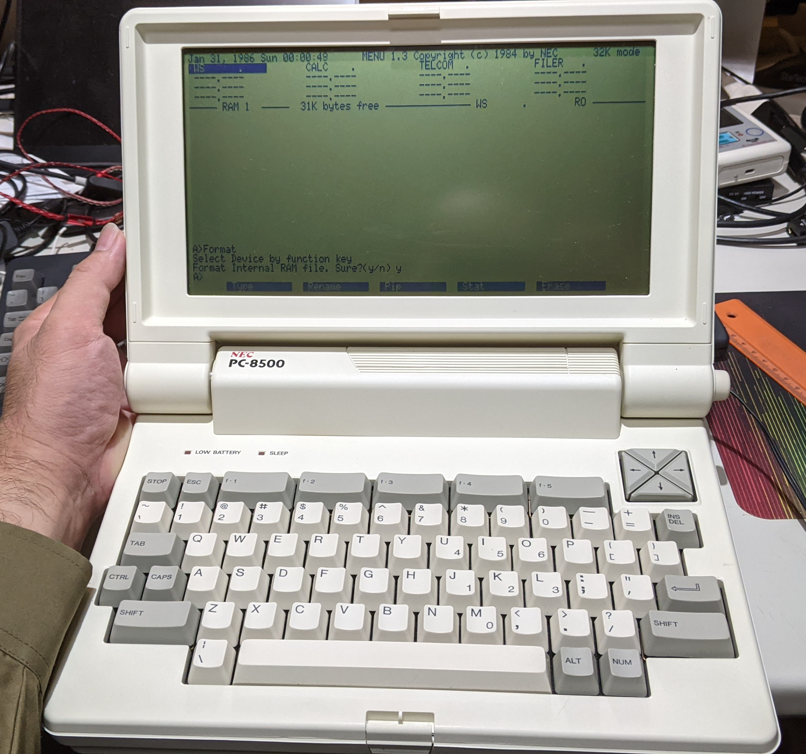
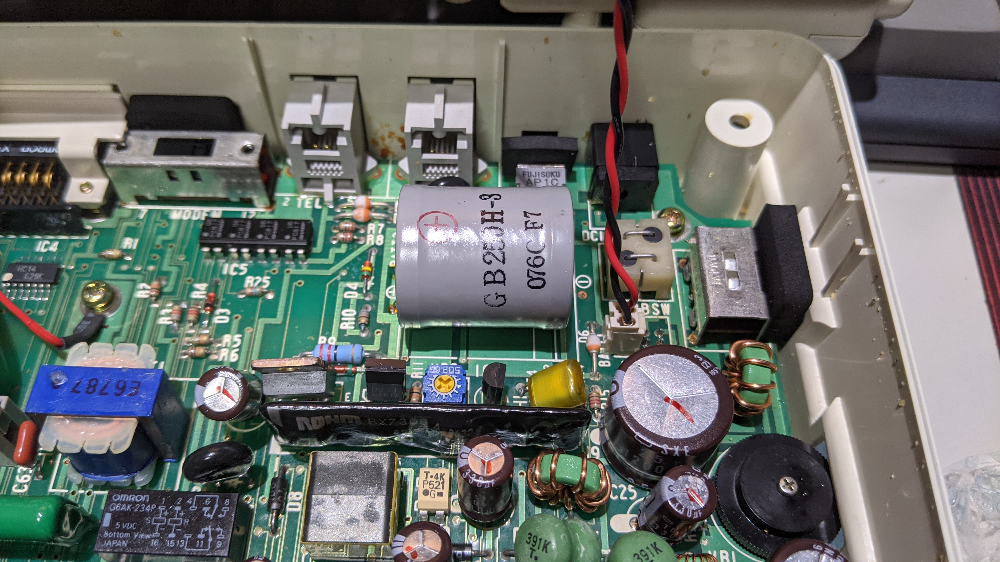
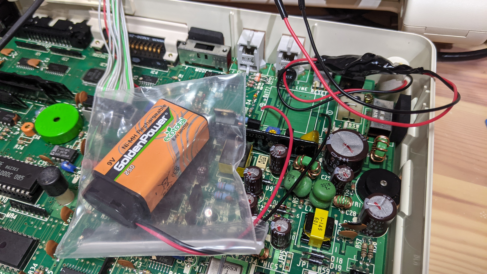

# NEC PC-8500 hacking

NEC PC-8500 is an older laptop CP/M-80 computer, last model on [PC-8200 (ja)](https://ja.wikipedia.org/wiki/PC-8200%E3%82%B7%E3%83%AA%E3%83%BC%E3%82%BA) series (OEM versioned: [Tandy RadioShack Model 100](https://en.wikipedia.org/wiki/TRS-80_Model_100))

I bought it, but does not exist any information at all... I begin recording about tech information on this repo.

----

## Replace memory backup battery

Memory backup battery maybe dead in 2021.
You can replace it located at below photo.

* Parts number: `GB250H-3`, but I couldn't find same battery.
* I replaced with 006P 9V NiMH battery with snap connector. Because it's popular battery form and easy to get.
  * CAUTION: You MUST replace with ONLY RECHARGEABLE battery.
  * CAUTION: You MUST DISCHARGE LOWER THAN 5V before connect. The battery backup voltage is 5V.

----

## Replace masked rom

[PC-8500 Masked rom riser PCB (Eagle CAD)](./pc8500romriser/)

----
## License

MIT (made by hand) or imported depending library supplier.

Supplier list:

* [Ultra Librarian](https://www.ultralibrarian.com/)
* [Snap EDA](https://www.snapeda.com/home/)
